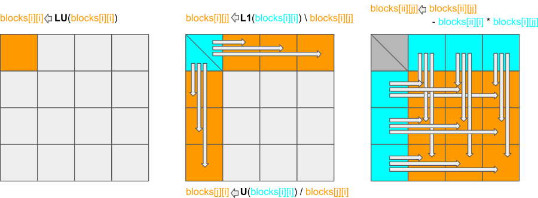

Example: LU factorization
-------------------------

.. objectives::

 - Apply task-based parallelism to a real algorithm.

Scalar algorithm
^^^^^^^^^^^^^^^^

The algorithm we are considering is called LU factorization (or LU decomposition) without pivoting.
Let :math:`A` be a square matrix. 
An LU factorization refers to the factorization of :math:`A` into a lower triangular matrix :math:`L` and an upper triangular matrix :math:`U`:

.. math:: A = L U.

For example, consider the following example from Wikipedia:

.. math::
    
    \left[
    \begin{matrix}
    4 & 3 \\
    6 & 3
    \end{matrix}
    \right]
    =
    \left[
    \begin{matrix}
    1   & 0 \\
    1.5 & 1
    \end{matrix}
    \right]
    \left[
    \begin{matrix}
    4   & 3 \\
    0   & -1.5
    \end{matrix}
    \right].

If we want to solve a system of linear equations

.. math:: A x = b

for :math:`x` and have already computed the LU factorization

.. math:: A = A U,

then we can solve :math:`A x = b` as follows:

 1. Solve the equation :math:`L y = b` for :math:`y`.

 2. Solve the equation :math:`U x = y` for :math:`x`.

The factorization is typically normalized such that the matrix :math:`L` is unit lower triangular, i.e., the diagonal entries are all ones.
This allows us to store the factor matrices on top of the original matrix:

.. math::

    A \leftarrow U + L - I.

In case of the earlier example, we get
    
.. math::
    
    \left[
    \begin{matrix}
    4   & 3 \\
    0   & -1.5
    \end{matrix}
    \right]
    +
    \left[
    \begin{matrix}
    1   & 0 \\
    1.5 & 1
    \end{matrix}
    \right]
    -
    \left[
    \begin{matrix}
    1 & 0 \\
    0 & 1
    \end{matrix}
    \right]
    =
    \left[
    \begin{matrix}
    4 & 3 \\
    1.5 & -1.5
    \end{matrix}
    \right].

Scalar implementation
"""""""""""""""""""""
    
The scalar sequential version of the algorithm is rather simple:
    
.. code-block:: c
    :linenos:
    
    void simple_lu(int n, int ld, double *A)
    {
        for (int i = 0; i < n; i++) {
            for (int j = i+1; j < n; j++) {
                A[i*ld+j] /= A[i*ld+i];

                for (int k = i+1; k < n; k++)
                    A[k*ld+j] -= A[i*ld+j] * A[k*ld+i];
            }
        }
    }

The LU factorization of the :math:`n \times n` matrix :math:`A` (column-major order with leading dimension :code:`ld`) is stored on top of the original matrix :math:`A`.

Test program
""""""""""""

We can validate the result with the following test program:

.. code-block:: c
    :linenos:

    #include <stdio.h>
    #include <stdlib.h>
    #include <time.h>

    extern void dtrmm_(char const *, char const *, char const *, char const *,
        int const *, int const *, double const *, double const *, int const *,
        double *, int const *);
    
    extern double dlange_(char const *, int const *, int const *, double const *,
        int const *, double *);
    
    void simple_lu(int n, int ld, double *A)
    {
        for (int i = 0; i < n; i++) {
            for (int j = i+1; j < n; j++) {
                A[i*ld+j] /= A[i*ld+i];

                for (int k = i+1; k < n; k++)
                    A[k*ld+j] -= A[i*ld+j] * A[k*ld+i];
            }
        }
    }
    
    // returns the ceil of a / b
    int DIVCEIL(int a, int b)
    {
        return (a+b-1)/b;
    }

    // computes C <- L * U
    void mul_lu(int n, int lda, int ldb, double const *A, double *B)
    {
        double one = 1.0;

        // B <- U(A) = U
        for (int i = 0; i < n; i++) {
            for (int j = 0; j < i+1; j++)
                B[i*ldb+j] = A[i*lda+j];
            for (int j = i+1; j < n; j++)
                B[i*ldb+j] = 0.0;
        }

        // B <- L1(A) * B = L * U
        dtrmm_("Left", "Lower", "No Transpose", "Unit triangular",
            &n, &n, &one, A, &lda, B, &ldb);
    }

    int main(int argc, char **argv)
    {    
        //
        // check arguments
        //
        
        if (argc != 2) {
            fprintf(stderr, 
                "[error] Incorrect arguments. Use %s (n)\n", argv[0]);
            return EXIT_FAILURE;
        }

        int n = atoi(argv[1]);
        if (n < 1)  {
            fprintf(stderr, "[error] Invalid matrix dimension.\n");
            return EXIT_FAILURE;
        }

        //
        // Initialize matrix A and store a duplicate to matrix B. Matrix C is for
        // validation.
        //
        
        srand(time(NULL));

        int ldA, ldB, ldC;
        ldA = ldB = ldC = DIVCEIL(n, 8)*8; // align to 64 bytes
        double *A = (double *) aligned_alloc(8, n*ldA*sizeof(double));
        double *B = (double *) aligned_alloc(8, n*ldB*sizeof(double));
        double *C = (double *) aligned_alloc(8, n*ldC*sizeof(double));
        
        if (A == NULL || B == NULL || C == NULL) {
            fprintf(stderr, "[error] Failed to allocate memory.\n");
            return EXIT_FAILURE;
        }

        // A <- random diagonally dominant matrix
        for (int i = 0; i < n; i++) {
            for (int j = 0; j < n; j++)
                A[i*ldA+j] = B[i*ldB+j] = 2.0*rand()/RAND_MAX - 1.0;
            A[i*ldA+i] = B[i*ldB+i] = 1.0*rand()/RAND_MAX + n;
        }

        //
        // compute
        //
        
        struct timespec ts_start;
        clock_gettime(CLOCK_MONOTONIC, &ts_start);

        // A <- (L,U)
        simple_lu(n, ldA, A);

        struct timespec ts_stop;
        clock_gettime(CLOCK_MONOTONIC, &ts_stop);

        printf("Time = %f s\n",
            ts_stop.tv_sec - ts_start.tv_sec +
            1.0E-9*(ts_stop.tv_nsec - ts_start.tv_nsec));

        // C <- L * U
        mul_lu(n, ldA, ldC, A, C);

        //
        // validate
        //
        
        // C <- L * U - B
        for (int i = 0; i < n; i++)
            for (int j = 0; j < n; j++)
                C[i*ldC+j] -= B[i*ldB+j];

        // compute || C ||_F / || B ||_F = || L * U - B ||_F  / || B ||_F
        double residual = dlange_("Frobenius", &n, &n, C, &ldC, NULL) /
            dlange_("Frobenius", &n, &n, B, &ldB, NULL);
            
        printf("Residual = %E\n", residual);
        
        int ret = EXIT_SUCCESS;
        if (1.0E-12 < residual) {
            fprintf(stderr, "The residual is too large.\n");
            ret = EXIT_FAILURE;
        }
        
        //
        // cleanup
        //

        free(A);
        free(B);
        free(C);

        return ret;
    }

We can compile and test the algorithm:
    
.. code-block:: bash

    $ gcc -o scalar scalar.c  -Wall ${LIBLAPACK} ${LIBBLAS}
    $ ./scalar 3000
    Time = 40.999184 s
    Residual = 1.708803E-15

Above, :code:`${LIBLAPACK}` and :code:`${LIBBLAS}` are the LAPACK and BLAS libraries, respectively.

Challenge
"""""""""

.. challenge::

    Compile and run the scalar implementation yourself.

Coarsely-blocked algorithm
^^^^^^^^^^^^^^^^^^^^^^^^^^

The above scalar algorithm cannot be parallelized efficiently because we cannot collapse the loops and the innermost loop is too short for effective parallelization.

Coarsely-blocked implementation
"""""""""""""""""""""""""""""""

We can solve some of the parallelization problems by writing the algorithm in a **blocked** form:

.. code-block:: c
    :linenos:
    :emphasize-lines: 4-11,23,28-29,32-33,37-39

    void blocked_lu(int block_size, int n, int ldA, double *A)
    {
        // allocate and fill an array that stores the block pointers
        int block_count = DIVCEIL(n, block_size);
        double ***blocks = (double ***) malloc(block_count*sizeof(double**));
        for (int i = 0; i < block_count; i++) {
            blocks[i] = (double **) malloc(block_count*sizeof(double*));

            for (int j = 0; j < block_count; j++)
                blocks[i][j] = A+(j*ldA+i)*block_size;
        }

        // iterate through the diagonal blocks
        for (int i = 0; i < block_count; i++) {

            // calculate diagonal block size
            int dsize = min(block_size, n-i*block_size);

            // calculate trailing matrix size
            int tsize = n-(i+1)*block_size;

            // compute the LU decomposition of the diagonal block
            simple_lu(dsize, ldA, blocks[i][i]);

            if (0 < tsize) {

                // blocks[i][i+1:] <- L1(blocks[i][i]) \ blocks[i][i+1:]
                dtrsm_("Left", "Lower", "No transpose", "Unit triangular",
                    &dsize, &tsize, &one, blocks[i][i], &ldA, blocks[i][i+1], &ldA);

                // blocks[i+1:][i] <- U(blocks[i][i]) / blocks[i+1:][i]
                dtrsm_("Right", "Upper", "No Transpose", "Not unit triangular",
                    &tsize, &dsize, &one, blocks[i][i], &ldA, blocks[i+1][i], &ldA);

                // blocks[i+1:][i+1:] <- blocks[i+1:][i+1:] -
                //                          blocks[i+1:][i] * blocks[i][i+1:]
                dgemm_("No Transpose", "No Transpose",
                    &tsize, &tsize, &dsize, &minus_one, blocks[i+1][i],
                    &ldA, blocks[i][i+1], &ldA, &one, blocks[i+1][i+1], &ldA);
            }
        }

        // free allocated resources
        for (int i = 0; i < block_count; i++)
            free(blocks[i]);
        free(blocks);
    }

We have divided the matrix :math:`A` into square **blocks** (possibly excluding the last block row and column).
The two-dimensional array :code:`blocks` contains the addresses of the upper-left corners of the blocks.
That is, :code:`blocks[i-1][j-1]` is the block on the :code:`i`'th row and :code:`j`'th column of the matrix.
We then loop over the diagonal blocks as follows:

 1. We factorize the diagonal block using the scalar algorithm (:code:`simple_lu`).

 2. The sub-factor matrices are used to update the block row and the block column by solving two matrix equations (:code:`dtrsm_`).

 3. The trailing matrix is updated by computing a matrix-matrix multiplications (:code:`dgemm_`).

.. figure:: img/blocked_lu1.png

   Factorization of the first diagonal block, updates to the block row and column, and update to the trailing matrix.

The exact details are not that relevant as we are only interested in the data dependencies.
   
Test program
""""""""""""

.. code-block:: c
    :linenos:

    #include <stdio.h>
    #include <stdlib.h>
    #include <time.h>

    extern double dnrm2_(int const *, double const *, int const *);

    extern void dtrmm_(char const *, char const *, char const *, char const *,
        int const *, int const *, double const *, double const *, int const *,
        double *, int const *);

    extern void dlacpy_(char const *, int const *, int const *, double const *,
        int const *, double *, int const *);

    extern double dlange_(char const *, int const *, int const *, double const *,
        int const *, double *);

    extern void dtrsm_(char const *, char const *, char const *, char const *,
        int const *, int const *, double const *, double const *, int const *,
        double *, int const *);

    extern void dgemm_(char const *, char const *, int const *, int const *,
        int const *, double const *, double const *, int const *, double const *,
        int const *, double const *, double *, int const *);

    double one = 1.0;
    double minus_one = -1.0;

    // returns the ceil of a / b
    int DIVCEIL(int a, int b)
    {
        return (a+b-1)/b;
    }

    // returns the minimum of a and b
    int MIN(int a, int b)
    {
        return a < b ? a : b;
    }

    void simple_lu(int n, int ldA, double *A)
    {
        for (int i = 0; i < n; i++) {
            for (int j = i+1; j < n; j++) {
                A[i*ldA+j] /= A[i*ldA+i];

                for (int k = i+1; k < n; k++)
                    A[k*ldA+j] -= A[i*ldA+j] * A[k*ldA+i];
            }
        }
    }

    void blocked_lu(int block_size, int n, int ldA, double *A)
    {
        // allocate and fill an array that stores the block pointers
        int block_count = DIVCEIL(n, block_size);
        double ***blocks = (double ***) malloc(block_count*sizeof(double**));
        for (int i = 0; i < block_count; i++) {
            blocks[i] = (double **) malloc(block_count*sizeof(double*));

            for (int j = 0; j < block_count; j++)
                blocks[i][j] = A+(j*ldA+i)*block_size;
        }

        // iterate through the diagonal blocks
        for (int i = 0; i < block_count; i++) {

            // calculate diagonal block size
            int dsize = MIN(block_size, n-i*block_size);

            // calculate trailing matrix size
            int tsize = n-(i+1)*block_size;

            // compute the LU decomposition of the diagonal block
            simple_lu(dsize, ldA, blocks[i][i]);

            if (0 < tsize) {

                // blocks[i][i+1:] <- L1(blocks[i][i]) \ blocks[i][i+1:]
                dtrsm_("Left", "Lower", "No transpose", "Unit triangular",
                    &dsize, &tsize, &one, blocks[i][i], &ldA, blocks[i][i+1], &ldA);

                // blocks[i+1:][i] <- U(blocks[i][i]) / blocks[i+1:][i]
                dtrsm_("Right", "Upper", "No Transpose", "Not unit triangular",
                    &tsize, &dsize, &one, blocks[i][i], &ldA, blocks[i+1][i], &ldA);

                // blocks[i+1:][i+1:] <- blocks[i+1:][i+1:] -
                //                          blocks[i+1:][i] * blocks[i][i+1:]
                dgemm_("No Transpose", "No Transpose",
                    &tsize, &tsize, &dsize, &minus_one, blocks[i+1][i],
                    &ldA, blocks[i][i+1], &ldA, &one, blocks[i+1][i+1], &ldA);
            }
        }

        // free allocated resources
        for (int i = 0; i < block_count; i++)
            free(blocks[i]);
        free(blocks);
    }

    // computes C <- L * U
    void mul_lu(int n, int lda, int ldb, double const *A, double *B)
    {
        // B <- U(A) = U
        for (int i = 0; i < n; i++) {
            for (int j = 0; j < i+1; j++)
                B[i*ldb+j] = A[i*lda+j];
            for (int j = i+1; j < n; j++)
                B[i*ldb+j] = 0.0;
        }

        // B <- L1(A) * B = L * U
        dtrmm_("Left", "Lower", "No Transpose", "Unit triangular",
            &n, &n, &one, A, &lda, B, &ldb);
    }

    int main(int argc, char **argv)
    {
        //
        // check arguments
        //

        if (argc != 3) {
            fprintf(stderr,
                "[error] Incorrect arguments. Use %s (n) (block size)\n", argv[0]);
            return EXIT_FAILURE;
        }

        int n = atoi(argv[1]);
        if (n < 1)  {
            fprintf(stderr, "[error] Invalid matrix dimension.\n");
            return EXIT_FAILURE;
        }

        int block_size = atoi(argv[2]);
        if (block_size < 2)  {
            fprintf(stderr, "[error] Invalid block size.\n");
            return EXIT_FAILURE;
        }

        //
        // Initialize matrix A and store a duplicate to matrix B. Matrix C is for
        // validation.
        //

        srand(time(NULL));

        int ldA, ldB, ldC;
        ldA = ldB = ldC = DIVCEIL(n, 8)*8; // align to 64 bytes
        double *A = (double *) aligned_alloc(8, n*ldA*sizeof(double));
        double *B = (double *) aligned_alloc(8, n*ldB*sizeof(double));
        double *C = (double *) aligned_alloc(8, n*ldC*sizeof(double));

        if (A == NULL || B == NULL || C == NULL) {
            fprintf(stderr, "[error] Failed to allocate memory.\n");
            return EXIT_FAILURE;
        }

        // A <- random diagonally dominant matrix
        for (int i = 0; i < n; i++) {
            for (int j = 0; j < n; j++)
                A[i*ldA+j] = B[i*ldB+j] = 2.0*rand()/RAND_MAX - 1.0;
            A[i*ldA+i] = B[i*ldB+i] = 1.0*rand()/RAND_MAX + n;
        }

        //
        // compute
        //

        struct timespec ts_start;
        clock_gettime(CLOCK_MONOTONIC, &ts_start);

        // A <- (L,U)
        blocked_lu(block_size, n, ldA, A);

        struct timespec ts_stop;
        clock_gettime(CLOCK_MONOTONIC, &ts_stop);

        printf("Time = %f s\n",
            ts_stop.tv_sec - ts_start.tv_sec +
            1.0E-9*(ts_stop.tv_nsec - ts_start.tv_nsec));

        // C <- L * U
        mul_lu(n, ldA, ldC, A, C);

        //
        // validate
        //

        // C <- L * U - B
        for (int i = 0; i < n; i++)
            for (int j = 0; j < n; j++)
                C[i*ldC+j] -= B[i*ldB+j];

        // compute || C ||_F / || B ||_F = || L * U - B ||_F  / || B ||_F
        double residual = dlange_("Frobenius", &n, &n, C, &ldC, NULL) /
            dlange_("Frobenius", &n, &n, B, &ldB, NULL);

        printf("Residual = %E\n", residual);

        int ret = EXIT_SUCCESS;
        if (1.0E-12 < residual) {
            fprintf(stderr, "The residual is too large.\n");
            ret = EXIT_FAILURE;
        }

        //
        // cleanup
        //

        free(A);
        free(B);
        free(C);

        return ret;
    }

We can compile and test the algorithm:
    
.. code-block:: bash

    $ gcc -o coarse-blocked coarse-blocked.c -Wall ${LIBLAPACK} ${LIBBLAS}
    $ ./coarse-blocked 3000 128
    Time = 0.925868 s
    Residual = 3.997311E-16

The second argument is the block size.
We can see that the blocked variant is significantly faster even before it it parallelized.

Challenge
"""""""""

.. challenge::

    Try to parallelize the block row on column updates (:code:`dtrsm_`).
    Try both
    
     - the :code:`#pragma omp parallel sections` and :code:`#pragma omp section` constructs and
     
     - the :code:`#pragma omp task` construct.
    
    Do you notice any difference in the run time?

.. solution::

    .. code-block:: c
        :linenos:
        :emphasize-lines: 27,30,36
        
        void blocked_lu(int block_size, int n, int ldA, double *A)
        {
            // allocate and fill an array that stores the block pointers
            int block_count = DIVCEIL(n, block_size);
            double ***blocks = (double ***) malloc(block_count*sizeof(double**));
            for (int i = 0; i < block_count; i++) {
                blocks[i] = (double **) malloc(block_count*sizeof(double*));

                for (int j = 0; j < block_count; j++)
                    blocks[i][j] = A+(j*ldA+i)*block_size;
            }

            // iterate through the diagonal blocks
            for (int i = 0; i < block_count; i++) {

                // calculate diagonal block size
                int dsize = MIN(block_size, n-i*block_size);

                // calculate trailing matrix size
                int tsize = n-(i+1)*block_size;

                // compute the LU decomposition of the diagonal block
                simple_lu(dsize, ldA, blocks[i][i]);

                if (0 < tsize) {

                    #pragma omp parallel sections
                    {
                        // blocks[i][i+1:] <- L1(blocks[i][i]) \ blocks[i][i+1:]
                        #pragma omp section
                        dtrsm_("Left", "Lower", "No transpose", "Unit triangular",
                            &dsize, &tsize, &one, blocks[i][i], &ldA, blocks[i][i+1],
                            &ldA);

                        // blocks[i+1:][i] <- U(blocks[i][i]) / blocks[i+1:][i]
                        #pragma omp section
                        dtrsm_("Right", "Upper", "No Transpose", "Not unit triangular",
                            &tsize, &dsize, &one, blocks[i][i], &ldA, blocks[i+1][i],
                            &ldA);
                    }

                    // blocks[i+1:][i+1:] <- blocks[i+1:][i+1:] -
                    //                          blocks[i+1:][i] * blocks[i][i+1:]
                    dgemm_("No Transpose", "No Transpose",
                        &tsize, &tsize, &dsize, &minus_one, blocks[i+1][i],
                        &ldA, blocks[i][i+1], &ldA, &one, blocks[i+1][i+1], &ldA);
                }
            }

            // free allocated resources
            for (int i = 0; i < block_count; i++)
                free(blocks[i]);
            free(blocks);
        }

    .. code-block:: bash

        $ gcc -o section-coarse-blocked section-coarse-blocked.c -Wall ${LIBLAPACK} ${LIBBLAS}
        $ ./section-coarse-blocked 3000 128
        Time = 0.927376 s
        Residual = 3.861916E-16
        
    .. code-block:: c
        :linenos:
        :emphasize-lines: 27-28,31,37
        
        void blocked_lu(int block_size, int n, int ldA, double *A)
        {
            // allocate and fill an array that stores the block pointers
            int block_count = DIVCEIL(n, block_size);
            double ***blocks = (double ***) malloc(block_count*sizeof(double**));
            for (int i = 0; i < block_count; i++) {
                blocks[i] = (double **) malloc(block_count*sizeof(double*));

                for (int j = 0; j < block_count; j++)
                    blocks[i][j] = A+(j*ldA+i)*block_size;
            }

            // iterate through the diagonal blocks
            for (int i = 0; i < block_count; i++) {

                // calculate diagonal block size
                int dsize = MIN(block_size, n-i*block_size);

                // calculate trailing matrix size
                int tsize = n-(i+1)*block_size;

                // compute the LU decomposition of the diagonal block
                simple_lu(dsize, ldA, blocks[i][i]);

                if (0 < tsize) {

                    #pragma omp parallel
                    #pragma omp single
                    {
                        // blocks[i][i+1:] <- L1(blocks[i][i]) \ blocks[i][i+1:]
                        #pragma omp task
                        dtrsm_("Left", "Lower", "No transpose", "Unit triangular",
                            &dsize, &tsize, &one, blocks[i][i], &ldA, blocks[i][i+1],
                            &ldA);

                        // blocks[i+1:][i] <- U(blocks[i][i]) / blocks[i+1:][i]
                        #pragma omp task
                        dtrsm_("Right", "Upper", "No Transpose", "Not unit triangular",
                            &tsize, &dsize, &one, blocks[i][i], &ldA, blocks[i+1][i],
                            &ldA);
                    }

                    // blocks[i+1:][i+1:] <- blocks[i+1:][i+1:] -
                    //                          blocks[i+1:][i] * blocks[i][i+1:]
                    dgemm_("No Transpose", "No Transpose",
                        &tsize, &tsize, &dsize, &minus_one, blocks[i+1][i],
                        &ldA, blocks[i][i+1], &ldA, &one, blocks[i+1][i+1], &ldA);
                }
            }

            // free allocated resources
            for (int i = 0; i < block_count; i++)
                free(blocks[i]);
            free(blocks);
        }
        
    .. code-block:: bash

        $ gcc -o task-coarse-blocked task-coarse-blocked.c -Wall ${LIBLAPACK} ${LIBBLAS}
        $ ./task-coarse-blocked 3000 128
        Time = 0.925464 s
        Residual = 3.852532E-16
        
    No difference in run time due to limited level of parallelism.
    
Finely-blocked algorithm
^^^^^^^^^^^^^^^^^^^^^^^^

   Factorization of the first diagonal block, updates to the block row and column blocks, and updates to the trailing matrix blocks.
