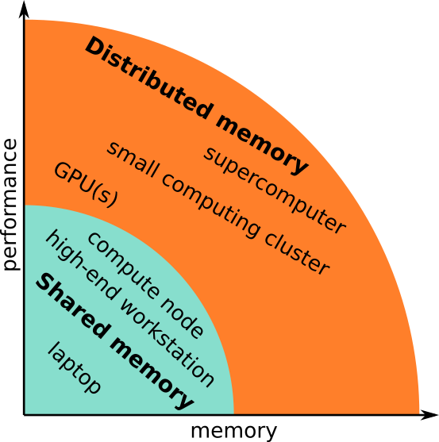
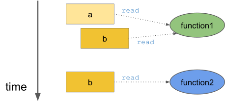
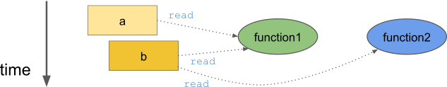
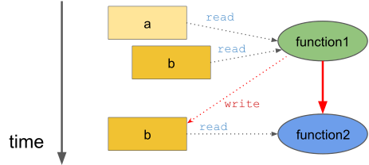
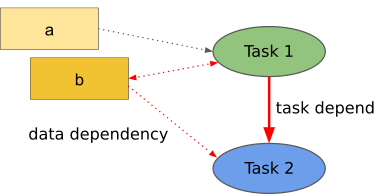
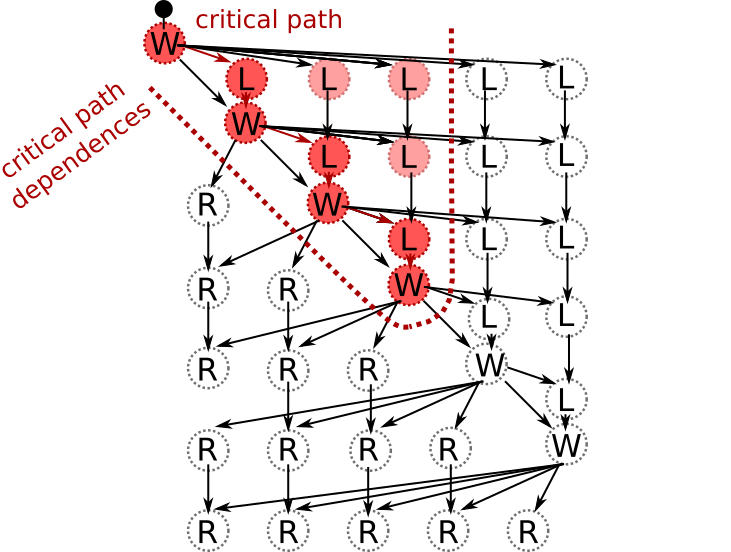
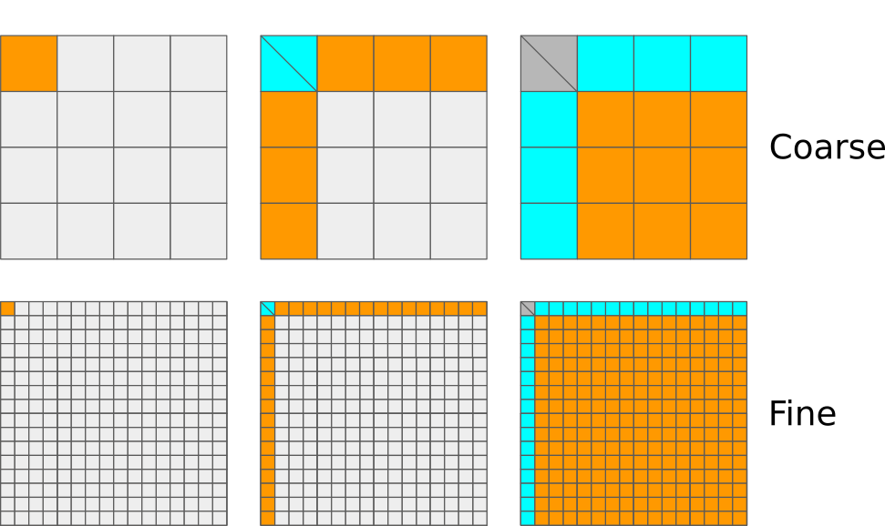

Introduction to task-based parallelism
--------------------------------------

.. objectives::

 - A quick refers to parallel computation and HPC.
 - Understand the basics of task-based parallelism.
 - Understand the theoretical benefit of task-based parallelism.

Parallel computation and HPC
^^^^^^^^^^^^^^^^^^^^^^^^^^^^
 
What is High Performance Computing?
"""""""""""""""""""""""""""""""""""

*High Performance Computing most generally refers to the practice of aggregating computing power in a way that delivers much higher performance than one could get out of a typical desktop computer or workstation in order to solve large problems in science, engineering, or business.* (`insideHPC.com <https://insidehpc.com/hpc-basic-training/what-is-hpc/>`__)

What does this mean?
 - Aggregating computing power
    - Kebnekaise: 602 nodes in 15 racks totalling 19288 cores
    - Your laptop: 4 cores
 - Higher performance
    - Kebnekaise: 728,000 billion arithmetical operations per second
    - Your laptop: 200 billion arithmetical operations per second
 - Solve large problems
    - **Time:** The time required to form a solution to the problem is very long.
    - **Memory:** The solution of the problem requires a lot of memory and/or storage.

.. figure:: img/hpc.png
    :align: center
    :scale: 70 %
    
Memory models
"""""""""""""

Then it comes to the memory layout, (super)computers can be divided into two primary categories: 

:Shared memory: A **single** memory space for all data:

 - Everyone can access the same data.
 - Straightforward to use.

 .. figure:: img/sm.png
    :align: left
    :scale: 70 %
    
:Distributed memory: **Multiple distinct** memory spaces for the data:

 - Everyone has direct access only to the **local data**.
 - Requires **communication** and **data transfers**.

 .. figure:: img/dm.png
    :align: left
    :scale: 70 %

Computing cluster and supercomputers are generally distributed memory machines:
    

    
Programming models
""""""""""""""""""

The programming model changes when we aim for extra performance and/or memory:

:Single-core: Matlab, Python, C, Fortran, ...

 - **Single stream of operations** (thread).
 - **Single pool of data**.
    
 .. figure:: img/single-core.png
    :align: left
    :scale: 70 %

:Multi-core: Vectorized Matlab, pthreads, **OpenMP**

 - **Multiple** streams of operations (multiple threads).
 - Single pool of data.
 - Extra challenges:
 
    - **Work distribution**.
    - **Coordination** (synchronization, etc).

 .. figure:: img/multi-core.png
    :align: left
    :scale: 70 %
    
:Distributed memory: **MPI**, ...

 - Multiple streams of operations (multiple threads).
 - **Multiple** pools of data.
 - Extra challenges:
 
    - Work distribution.
    - Coordination (synchronization, etc).
    - **Data distribution**.
    - **Communication** and **data transfers**.

 .. figure:: img/distributed-memory.png
    :align: left
    :scale: 70 %
 
:Accelerators / GPUs: **CUDA**, OpenCL, OpenACC, OpenMP, ...

 - Single/multiple streams of operations on the **host device**.
 - Many **lightweight** streams of operations on the **accelerator**.
 - Multiple pools of data on **multiple layers**.
 - Extra challenges:
 
    - Work distribution.
    - Coordination (synchronization, etc).
    - Data distribution across **multiple memory spaces**.
    - Communication and data transfers.

 .. figure:: img/gpu.png
    :align: left
    :scale: 70 %

:Hybrid: MPI **+** OpenMP, OpenMP **+** CUDA, MPI **+** CUDA, ...

 - Combines the benefits and the downsides of several programming models.
 
 .. figure:: img/hybrid.png
    :align: left
    :scale: 65 %

:Task-based: OpenMP tasks, StarPU

 - Does task-based programming count as a separate programming model?
 - StarPU = (implicit) MPI + (implicit) pthreads + CUDA
    
Functions and data dependencies
^^^^^^^^^^^^^^^^^^^^^^^^^^^^^^^

Imagine the following computer program:

.. code-block:: c
    :linenos:
    
    #include <stdio.h>
    
    void function1(int a, int b) {
        printf("The sum is %d.\n", a + b);
    }
    
    void function2(int b) {
        printf("The sum is %d.\n", 10 + b);
    }
    
    int main() {
        int a = 10, b = 7;
        function1(a, b);
        function2(b);
        return 0;
    }

The program consists of two functions, :code:`function1` and :code:`function2`, that are called **one after another** from the :code:`main` function.
The first function reads the variables :code:`a` and :code:`b`, and the second function reads the variable :code:`b`:

The program prints the line :code:`The sum is 17.` twice.
The key observation is that the two functions calls are **independent** of each other.
More importantly, the two functions can be executed in **parallel**:

Lets modify the the program slightly:

.. code-block:: c
    :linenos:
    :emphasize-lines: 3-6,14
    
    #include <stdio.h>
    
    void function1(int a, int *b) {
        printf("The sum is %d.\n", a + *b);
        *b += 3;
    }
    
    void function2(int b) {
        printf("The sum is %d.\n", 10 + b);
    }
    
    int main() {
        int a = 10, b = 7;
        function1(a, &b);
        function2(b);
        return 0;
    }

This time the function :code:`function1` modifies the variable :code:`b`:
    
.. figure:: img/functions_dep.png

Therefore, the two functions calls are **not** independent of each other and changing the order would change the printed lines.
Furthermore, executing the two functions in parallel would lead to an **undefined result** as the execution order would be arbitrary.

We could say that **in this particular context**, the function :code:`function2` is a **dependent** on the function :code:`function1`.
That is, the function :code:`function1` must be executed completely before the function :code:`function2` can be executed:

However, this **data dependency** exists only when these two functions are called in this particular sequence using these particular arguments.
In a different context, this particular data dependency does not exists.
We can therefore conclude that the **data dependencies are separate from the functions definitions**.

Tasks and task dependencies
^^^^^^^^^^^^^^^^^^^^^^^^^^^

Based on the previous discussion, we need an object that can describe the following:

 1. The operation that is to be performed (implementation).
 2. The data that involved in the operation (input and output).
 3. The way in which the operations is related to other operations (dependencies).
 
We call this objects **tasks**.
The previous example code can be described using two tasks:

:Task 1:

 - Operation: :code:`function1`.
 - Input: variables :code:`a` and :code:`b`.
 - Output: updated variable :code:`b`.
 - Depends on: none

:Task 2:

 - Operation: :code:`function2`.
 - Input: variable :code:`b`.
 - Output: none.
 - Depends on: Task 1

We can represent the **task dependencies** using a Directed Acyclic Graph (DAG).
This DAG is generally referred as the **task graph**:
 

 
If we know what is the **sequential order** to execute the tasks, then we can deduce that *task dependencies* from the *data dependencies*.
This is indeed what happens in practice as a programmer generally defines only 

 - the task implementations, and 
 - the input and output variables.
 
So-called **runtime system** then deduces the task dependencies from the sequentially order and the input and output variables.
We say that the task graph is constructed **implicitly**.
The runtime system then executes the task in a **sequentially consistent order**.
That is, the runtime system may execute the task in any order as long as it respects the task dependencies.

A task-graph can also be constructed **explicitly**, i.e. a programmer defines both 

 - the task implementations and 
 - the task dependencies.
 
This can reduce the overhead that arises from the construction of the task graph.

More about task graphs
^^^^^^^^^^^^^^^^^^^^^^

Lets consider a slightly more complicated situation.
Consider an algorithm that consists of three steps that are iterated multiple times:

 1. Compute a **diagonal block** (orange).
 2. Update the corresponding block row and column (blue).
 3. Update the corresponding trailing matrix (green).

We do not need to know how the tasks are implemented.
We are only interested on the task dependencies:

.. figure:: img/blocked_lu_simple.png
    :scale: 70 %

That is, 

 - the block row and column updates are dependent on the computed diagonal block,
 - the trailing matrix updates are dependent on the block row and column updates, and
 - the next diagonal block is dependent on one of the trailing matrix updates.

Real-world task graph
"""""""""""""""""""""
 
We can represent these tasks and the related tasks dependencies using a task graph:
 
.. figure:: img/lu_task_graph.png
    :scale: 70 %
 
We can see that this task graph is much more complicated than the previous one.
On the left, we can see how much parallelism can be exposed if we implement the algorithm using nested loops without considering the task graph:

.. code-block::

    for i = 1, ..., m:
        compute diagonal block A[i][i]
        parallel for j = i+1, ..., m:
            update block A[i][j] using A[i][i]
        parallel for j = i+1, ..., m:
            update block A[j][i] using A[i][i]
        parallel for ii = i+1, ..., m and jj = i+1, ..., m:
            update block A[ii][jj] using A[i][jj] and A[ii][i]
 
We can observe that the degree of parallelism decreases as the algorithm progresses.
This can cause **load balancing issues** as more and more CPU cores become idle during the last iterations:

.. figure:: img/lu_task_graph2.png
    :scale: 70 %

However, as shown on the right, we could have advanced to the same diagonal block by executing only a subset of the tasks.
The **delayed tasks** can be used to keep the otherwise idle CPU cores busy.

Critical path
"""""""""""""

In this particular example, we have executed the tasks such a manner that only the absolutely necessary tasks are executed.
We can also find the **longest path through the task graph** (when measured in the terms of execution time):

.. figure:: img/lu_task_graph3.png
    :scale: 70 %

This so-called **critical path** gives us a **lower bound** for the execution time of the algorithm.
The algorithm cannot be executed any faster than this no matter how many CPU cores are used.

Task scheduling and priorities
^^^^^^^^^^^^^^^^^^^^^^^^^^^^^^

Lets consider a different algorithm.
Again, we only care about the data dependencies:

.. figure:: img/chain_flow.png
    :scale: 60 %

We can see that the task graph consists from three types of tasks:

:Process window (W):    Perform a computation operation inside a diagonal block (a set of small orthogonal transformations).

:Right update (R):      Updates the matrix from the right (orthogonal transformation).

:Left update (L):       Updates the matrix from the left (orthogonal transformation).

We know two additional things about the algorithm:

 1. The process windows tasks are more time consuming that the left and right update tasks.
 2. The left and right update tasks are equally time consuming.
 
How should we schedule this task graph?
"""""""""""""""""""""""""""""""""""""""
 
We can quite easily discover the critical path:

.. figure:: img/chain_flow3.png
    :scale: 65 %

In order for us to advance along the critical path, we must also execute the **critical path dependencies**: 
    

In the above illustration, we have executed only the critical path and its dependencies.
However, we do not have to restrict ourselves in this manner since other tasks are **ready for scheduling**:
    
.. figure:: img/chain_flow5.png
    :scale: 65 %
    
We could therefore use any idle cores to execute these tasks.
However, since the left update tasks (L) **feed back to the critical path**, we may want to **prioritize** them over the right update tasks (R).
This would indirectly **accelerate the critical path** as the next batch of left update tasks (L) becomes available earlier:
    
.. figure:: img/chain_flow6.png
    :scale: 65 %

Heuristics scheduling approach
""""""""""""""""""""""""""""""
    
We must of course remember that task graph are usually much more complicated that this:
    
.. figure:: img/dag.png
    :scale: 35 %

The above task graph comes from so-called QR algorithm when it is applied to a very small matrix.
We could probably figure out a close-to-optimal scheduling order from this task graph.
However, the task graph is heavily preprocessed and its generation took **several minutes** where as the execution time of the algorithm is just **a few hundred milliseconds**.
We therefore need an **automated approach for traversing the task graph**.

We have two options:

 1. Analyse the entire task graph and locate the critical path. Schedule tasks that are on the critical path and their dependencies as early as possible.
 2. Rely on **heuristics**.

The first approach would lead to optimal performance but assumes that

 - we know the entire task graph and
 - we know how long each task is going to take to execute.

We generally do not have this information, especially if we are dealing with an iterative algorithm.

Most runtime systems therefore rely on **list-based heuristics** and **priorities**.
That is, a runtime system maintains four task pools:

:Submitted tasks:   Tasks that are not scheduled and are not ready for scheduling.
:Ready tasks:       Tasks that are not scheduled and are ready for scheduling.
:Active tasks:      Tasks that are scheduled, i.e. are currently begin executed.
:Completed tasks:   Tasks that have been scheduled.

.. figure:: img/scheduling.png
    :scale: 60 %

A runtime system follows these basic rules:

 1. When a task becomes ready for scheduling, i.e. all its dependencies have been satisfied, it is moved from the *submitted pool* to the *ready pool*.
 
 2. A task is moved from the *ready pool* to the *active pool* when it are scheduled for execution on a computational resource.
   
    - A programmer may define a priority for each tasks.
      These priorities are taken into account when a tasks is selected for execution from the *ready pool*.
 
 3. A task is moved from the *active pool* to the *complicated pool* when the related computational resource has finished executing the task.
 
    - Any tasks, that depend on the current tasks and have all their other dependencies satisfied, are moved from the *submitted pool* to the *ready pool*.

This approach is relatively simple to implement using (ordered) lists.
However, runtime system's view of the task graph is very narrow as it sees only the *ready pool* when it is doing the actual scheduling decisions.
In particular, **note that the task priorities take an effect only when task become ready for scheduling**.
    
Task granularity
^^^^^^^^^^^^^^^^

Task granularity tells us how "large" the tasks are and how many of them there are.
This can affect the performance because

 1. the use of the runtime system introduces some additional overhead,
 2. different task sizes lead to different task-specific performance, and
 3. the *ready pool* size depends on the initial *submitted pool* size.

It is therefore very important that the task granularity is **balanced**.
 
For example, consider the earlier example:
 

If the task granularity is very **coarse**, then

 1. the number of tasks is very low and the runtime system therefore does not introduce that much overhead,
 2. the tasks are relatively large and have a relatively high task-specific performance, and
 3. only a very small number of task can be ready for scheduling at any given time.
 
If the task granuality is very **fine**, then

 1. the number of tasks is very high and the runtime system therefore introduces a lot of additional overhead,
 2. the tasks are very small and have a very low task-specific performance, and
 3. a very large number of task can be ready for scheduling at any given time.

Both of these extremes lead to lowered performance.
We want to keep most computational resources busy most of the time.

Benefits of task-based parallelism
^^^^^^^^^^^^^^^^^^^^^^^^^^^^^^^^^^

Lets summarise some of the major benefits of task-based parallelism:

:Automatic parallelism:

    If the task task graph has **potential for parallel computation**, then the runtime system can discover it.
    An algorithm that has been implemented in a task-manner can therefore parallelise automatically.

:No synchronization:

    A parallel algorithm often involves several synchronization points.
    Sometimes there synchronization points arise from the underlying data dependencies.
    However, it is quite often the case that **synchronisation points are used to simplify the implementation**.
    The latter type of **synchronisation points are not necessary** in a task-based implementation.

:Better load balancing:

    The tasks are scheduled **dynamically** to the various computational resources.
    Furthermore, **low-priority tasks can be delayed** until the computational resources start becoming idle.
    These two factors help the improve the load balancing.

:Shortened critical path:

    If we help the runtime system by defining priorities, the runtime system can complete the critical path earlier.

:GPUs and other accelerators:

    Tasks can be scheduled to accelerator devices such as GPUs.
    This can happen dynamically using performance models (StarPU).

:Distributed memory:

    The task graph and data distribution induce the necessary communication pattern (StarPU).
