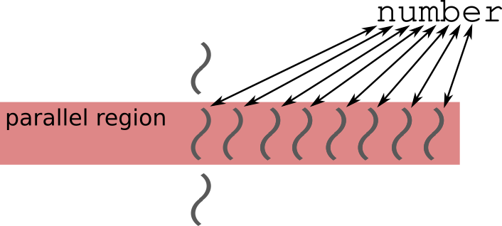
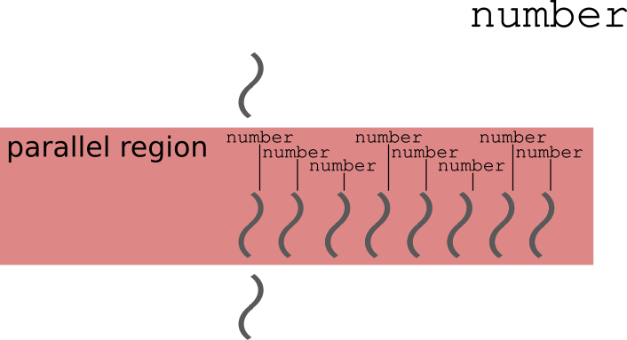

Introduction to OpenMP (part 1)
-------------------------------

.. objectives::

 - Understand the basics of OpenMP

`OpenMP <https://www.openmp.org/>`__ (*Open Multi-Processing*) is a programming API for shared-memory parallel programming in C, C++, and Fortran languages.
It is based on **pragmas** or **directives** which augment the source code and change how a compiler processes the source code.
In case of OpenMP, the pragmas specify how the code is to be parallelized.

.. important::

    The Kebnekaise login nodes have the :code:`OMP_NUM_THREADS` environmental variable set to :code:`1`.
    If you are using the Kebnekaise login nodes to experiment with OpenMP, then it is important to set the :code:`OMP_NUM_THREADS` environmental variable to some reasonable value:
    
    .. code-block:: bash
    
        $ export OMP_NUM_THREADS=8

    Please note that you are not allowed to run long computations on the login nodes!
        
Simple example
^^^^^^^^^^^^^^

Consider the following "Hello world" program:

.. code-block:: c
    :linenos:

    #include <stdio.h>
    
    int main() {
        printf("Hello world!\n");
        return 0;
    }

We can confirm that the code indeed behaves the way we expect:
    
.. code-block:: bash
    :emphasize-lines: 3

    $ gcc -o my_program my_program.c -Wall
    $ ./my_program
    Hello world!

Let us modify the program by adding an OpenMP pragma:
    
.. code-block:: c
    :linenos:
    :emphasize-lines: 4

    #include <stdio.h>
    
    int main() {
        #pragma omp parallel
        printf("Hello world!\n");
        return 0;
    }

This time the program behaves very differently (note the extra :code:`-fopenmp` compiler option):
    
.. code-block:: bash
    :emphasize-lines: 3-6

    $ gcc -o my_program my_program.c -Wall -fopenmp
    $ ./my_program 
    Hello world!
    Hello world!
    ...
    Hello world!

Clearly, the :code:`omp parallel` pragma caused the program to execute the :code:`printf` line **several times**.
If you go and try to execute the program on a different computer, you will observe that the number of lines printed is the same as the **number of processor cores in the computer**.
The :code:`-fopenmp` compiler option tells the compiler to expect OpenMP pragmas.

.. challenge::

    1. Compile the "Hello world" program yourself and try it out.
    
    2. See what happens if you set the :code:`OMP_NUM_THREADS` environmental variable to different values:
    
    .. code-block:: bash
    
        $ OMP_NUM_THREADS=<value> ./my_program
    
    What happens?
    Can you guess why?
    
.. solution::

    Let us try values 1, 4 and 8:

    .. code-block:: bash
        :emphasize-lines: 2,4-7,9-16

        $ OMP_NUM_THREADS=1 ./my_program
        Hello world!
        $ OMP_NUM_THREADS=4 ./my_program
        Hello world!
        Hello world!
        Hello world!
        Hello world!
        $ OMP_NUM_THREADS=8 ./my_program
        Hello world!
        Hello world!
        Hello world!
        Hello world!
        Hello world!
        Hello world!
        Hello world!
        Hello world!
    
    The "Hello world!" line is printed 1, 4 and 8 times.
    The :code:`OMP_NUM_THREADS` environmental variable sets the default team size (see below).

OpenMP pragmas and constructs
^^^^^^^^^^^^^^^^^^^^^^^^^^^^^

In C and C++, an OpenMP pragma has the following form:

.. code-block:: c

    #pragma omp directive-name [clause[ [,] clause] ... ] new-line

A compiler typically supports several types of pragmas, not just OpenMP pragmas.
Therefore, all OpenMP pragmas begin with the keywords :code:`#pragma omp`.
The :code:`directive-name` placeholder specifies the used OpenMP construct (e.g. :code:`parallel`) and a pragma is always followed by a new line.
Typically, a pragma affects the user code that follows it but some OpenMP pragmas are *stand-alone*.
You can span a pragma across multiple lines by using a backslash (:code:`\ `) immediately followed by a new line:

.. code-block:: c

    #pragma omp directive-name \
        [clause[ [,] \
        clause] ... ] new-line
        
Parallel construct
^^^^^^^^^^^^^^^^^^

In the earlier example, we used the :code:`parallel` pragma:

.. code-block:: c

    #pragma omp parallel [clause[ [,] clause] ... ] new-line 
        structured-block

The pragma creates a **team** of **OpenMP threads** that executes the :code:`structured-block` as a **parallel region**:

.. figure:: img/parallel_construct.png
    :align: center
    :scale: 75%

The :code:`structured-block` region can be a single statement, like in the earlier example, or a structured block consisting of several statements: 

.. code-block:: c

    #pragma omp parallel ...
    {
        statement1;
        statement2;
        ...
    }

OpenMP guarantees that all threads in the team have executed the structured block before the execution continues outside the parallel region. 
    
The behaviour of a parallel construct can be modified with several **clauses**:

.. code-block:: bash
    :emphasize-lines: 1-2

    if([parallel :] scalar-expression) 
    num_threads(integer-expression) 
    default(shared | none) 
    private(list) 
    firstprivate(list) 
    shared(list) 
    copyin(list) 
    reduction([reduction-modifier ,] reduction-identifier : list) 
    proc_bind(master | close | spread) 
    allocate([allocator :] list)

We will return to some of these clauses later but for now it is sufficient to know that a parallel construct can be selectively enabled/disabled with the :code:`if` clause and the size of the team can be explicitly set with the :code:`num_threads` clause.

.. challenge::

    Modify the following program such that the :code:`printf` line is executed only twice:
    
    .. code-block:: c
        :linenos:

        #include <stdio.h>
    
        int main() {
            #pragma omp parallel
            printf("Hello world!\n");
            return 0;
        }
    
    **Hint:** Each thread in the team executes the structured block once.

.. solution::

    Use the :code:`num_threads` clause to set the team size to two:

    .. code-block:: c
        :linenos:
        :emphasize-lines: 4

        #include <stdio.h>
    
        int main() {
            #pragma omp parallel num_threads(2)
            printf("Hello world!\n");
            return 0;
        }
    
    .. code-block:: bash
        :emphasize-lines: 3-4

        $ gcc -o my_program my_program.c -Wall -fopenmp
        $ ./my_program 
        Hello world!
        Hello world!

Data sharing rules
^^^^^^^^^^^^^^^^^^

Since the structured block that follows a parallel construct is executed in parallel by a team of threads, we must make sure that the related data accesses do not cause any **conflicts**.
For example, the behaviour of the following program is not well defined:

.. code-block:: c
    :linenos:

    #include <stdio.h>
    
    int main() {
        int number = 1;
        #pragma omp parallel
        printf("I think the number is %d.\n", number++);
        return 0;
    }

.. code-block:: bash
    :emphasize-lines: 3,6,7,9,12,13,14,16,17

    $ gcc -o my_program my_program.c -Wall -fopenmp
    $ ./my_program 
    I think the number is 2.
    I think the number is 8.
    ....
    I think the number is 1.
    I think the number is 1.
    ....
    I think the number is 2.
    ....
    $ ./my_program 
    I think the number is 1.
    I think the number is 1.
    I think the number is 2.
    ...
    I think the number is 1.
    I think the number is 2.
    ...

We can make two observations:

 1. The order in which the :code:`printf` statements are executed is arbitrary. This can be a desired behaviour.
 2. Some numbers are printed **multiple times**. This is usually an undesired behaviour.

The explanation is that once the team is created, the threads execute the structured block **independently** of each other.
This explain why the numbers are printed in an arbitrary order.
The threads also read and write the variable :code:`number` independently of each other which explain why some threads do not see the changes the other threads have made:

OpenMP implements a set of rules that define how variables behave inside OpenMP constructs.
All variables are either :code:`private` or :code:`shared`:

:Private:   Each thread has its own copy of the variable.
:Shared:    All threads share the same variable.

These basic **rules** apply:

 1. All variables declared outside parallel region are shared.
 2. All variables declared inside a parallel region are private.
 3. Loop counters are private (in parallel loops).

.. code-block:: c
    :linenos:
    :emphasize-lines: 1,4,8
    
    int a = 5;                  // shared
    
    int main() {
        int b = 44;             // shared
        
        #pragma omp parallel
        {
            int c = 3;          // private
        }
    }

In the above example, the variable :code:`number` is declared outside the parallel region and all threads therefore share the same variable.

.. challenge::

    Modify the following program such that the variable :code:`number` is declared inside the structured block and is therefore private:
    
    .. code-block:: c
        

        #include <stdio.h>
    
        int main() {
            int number = 1;
            #pragma omp parallel
            printf("I think the number is %d.\n", number++);
            return 0;
        }
    
    Run the program.
    Can you explain the behaviour?
    
    **Hint:** Remember that a structured block that consists of several statements must be enclosed inside :code:`{ }` brackets. 

.. solution::

    .. code-block:: c
        :linenos:
        :emphasize-lines: 5-8

        #include <stdio.h>

        int main() {
            #pragma omp parallel
            {
                int number = 1;
                printf("I think the number is %d.\n", number++);
            }
            return 0;
        }
        
    .. code-block:: bash
        :emphasize-lines: 3-6

        $ gcc -o my_program my_program.c -Wall -fopenmp
        $ ./my_program 
        I think the number is 1.
        I think the number is 1.
        ...
        I think the number is 1.
    
    Note that all treads print 1.
    This happens because each thread has its own :code:`number` variable that is initialized to 1.
    The incrementation affects only the thread's own copy of the variable.

We can use the **private** clause to turn a variable that has been declared outside a parallel region into a private variable:

.. code-block:: c
    :linenos:
    :emphasize-lines: 5

    #include <stdio.h>
    
    int main() {
        int number = 1;
        #pragma omp parallel private(number)
        printf("I think the number is %d.\n", number++);
        return 0;
    }

However, the end result is, once again, unexpected:

.. code-block:: bash
    :emphasize-lines: 3-6

    $ gcc -o my_program my_program.c -Wall -fopenmp
    $ ./my_program 
    I think the number is 0.
    I think the number is 0.
    I think the number is 0.
    ...

This happens because each thread has its own :code:`number` variable that is separate from the :code:`number` variable declared outside the parallel region:

The private variables do **not inherit the value of the original variable**.
If we want this to happen, then we must use the **firstprivate** clause:

.. code-block:: c
    :linenos:
    :emphasize-lines: 5

    #include <stdio.h>
    
    int main() {
        int number = 1;
        #pragma omp parallel firstprivate(number)
        printf("I think the number is %d.\n", number++);
        return 0;
    }

This time, the end result is as expected:

.. code-block:: bash
    :emphasize-lines: 3-6

    $ gcc -o my_program my_program.c -Wall -fopenmp
    $ ./my_program 
    I think the number is 1.
    I think the number is 1.
    I think the number is 1.
    ...

That is, the private variables inherits the value of the original variable:

.. figure:: img/firstprivate.png
    :align: center
    :scale: 75%

Explicit data sharing rules
^^^^^^^^^^^^^^^^^^^^^^^^^^^

The default behaviour can be changed with the **default** clause:

.. code-block:: c
    :linenos:
    :emphasize-lines: 5

    #include <stdio.h>
    
    int main() {
        int number = 1;
        #pragma omp parallel default(none)
        printf("I think the number is %d.\n", number++);
        return 0;
    }

This tells the compiler that a programmer must explicitly set the data sharing rule for each variable.
It is therefore not surprising that the compiler produces an error indicating that the :code:`number` variable is not specified in the enclosing parallel region:

.. code-block:: bash
    :emphasize-lines: 2-8

    $ gcc -o my_program my_program.c -Wall -fopenmp 
    my_program.c: In function ‘main’:
    my_program.c:6:5: error: ‘number’ not specified in enclosing ‘parallel’
        6 |     printf("I think the number is %d.\n", number++);
          |     ^~~~~~~~~~~~~~~~~~~~~~~~~~~~~~~~~~~~~~~~~~~~~~~
    my_program.c:5:13: error: enclosing ‘parallel’
        5 |     #pragma omp parallel default(none)
          |

We can now set the :code:`number` variable to firstprivate:

.. code-block:: c
    :linenos:
    :emphasize-lines: 5

    #include <stdio.h>
    
    int main() {
        int number = 1;
        #pragma omp parallel default(none) firstprivate(number)
        printf("I think the number is %d.\n", number++);
        return 0;
    }

It is **generally recommended** that a programmer sets the data sharing rules explicitly as this forces them to think about the data sharing rules.
It is also advisable to declare all private variables inside the structured block.

.. challenge::

    Fix the following program:
    
    .. code-block:: c
        :linenos:

        #include <stdio.h>

        char *str = "I think the number is %d.\n";

        int main() {
            int initial_number = 1;

            #pragma omp parallel
            int number = initial_number; 
            printf(str, number++);
    
            return 0;
        }

    Use explicit data sharing rules.

.. solution::

    .. code-block:: c
        :linenos:
        :emphasize-lines: 8,9,12
        
        #include <stdio.h>

        char *str = "I think the number is %d.\n";

        int main() {
            int initial_number = 1;

            #pragma omp parallel default(none) shared(str, initial_number)
            {
                int number = initial_number; 
                printf(str, number++);
            }
    
            return 0;
        }
         
    First, we add the enclosed :code:`{ }` brackets thus making the :code:`number` variable private.
    Next, we use :code:`default(none)` to force explicit data sharing rules.
    Finally, we declare the :code:`str` and :code:`initial_number` variables shared as none of the threads modify these variables.
    
    .. code-block:: bash

        $ gcc -o my_program my_program.c -Wall -fopenmp
        $ ./my_program 
        I think the number is 1.
        I think the number is 1.
        I think the number is 1.
        ...
    
    It is also possible to declare the variables :code:`str` and :code:`initial_number` as :code:`firstprivate`.
    However, the creation of private variables causes some overhead and it is therefore generally recommended that variables that can be declared shared are declared as shared.
