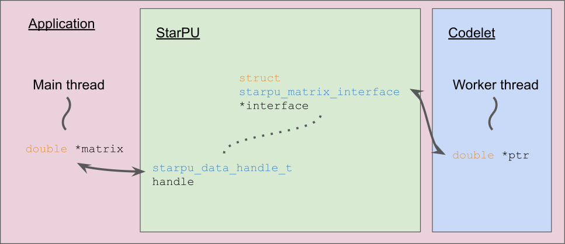
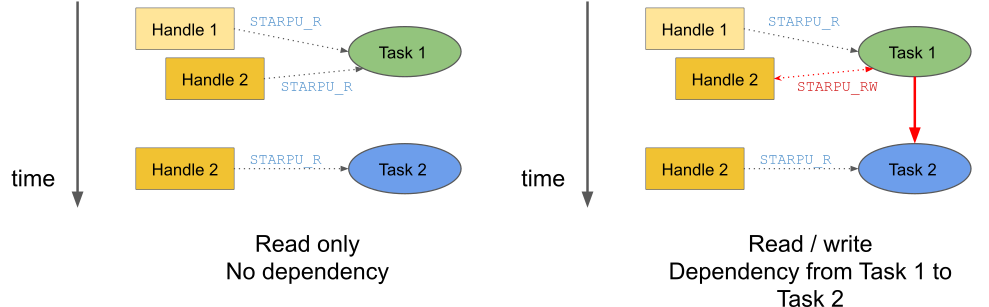

StarPU
------

.. objectives::

 - Understand the basics of StarPU
 - Understand how StarPU support distributed memory
 - Understand how StarPU support GPUs

`StarPU <https://starpu.gitlabpages.inria.fr/>`__ (*A Unified Runtime System for Heterogeneous Multicore Architectures*) is a programming API for shared-memory and distributed-memory parallel programming in C and C++ languages.
StarPU can also be used through OpenMP pragmas and provides the necessary routines and support to natively access most of its functionalities from Fortran 2008+ codes.
StarPU supports accelerator devices such as GPUs.

Benefits and downsides
^^^^^^^^^^^^^^^^^^^^^^

StarPU has several benefits:

 1. The StarPU API is very **rich** and partly **modular**.
 
    - A programmer can, for example, implement a custom modular scheduler.
    
 2. StarPU uses **performance models** to predict which computational resource is optimal in a given situation.
 
    - A programmer does not need to decide between a GPU and a GPU. 
    - StarPU does scheduling decisions dynamically during run time.
    
 3. StarPU supports distributed memory.
 
    - The MPI communications are done **implicitly**.
    - A programmer only needs to specify the data distribution.
    - The communication pattern is automatically derived from the task graph and the data distribution.

However, when compared to OpenMP tasks, StarPU has a few downsides:

 1. The API is more complex and requires more involvement from the programmer.
 
 2. The performance models are only as good as their calibration data.
 
 3. OpenMP is a well-established standard. StarPU is not.

How to use StarPU
^^^^^^^^^^^^^^^^^

Three ways to use StarPU:

 1. C extension: Simple pragma-based approach (does not work with all compilers).
 2. StarPU API: More powerful but complex (“traditional” C library).
 3. StarPU API with helper functions: Simplifies certain things (**our choice**).

Initialization and shutdown
"""""""""""""""""""""""""""
 
Since StarPU is a C library, **a programmer must initialize and shutdown the runtime system**.
The following three basic steps are necessary:

 1. Include `starpu.h` header file:
 
    .. code-block:: c
    
        #include <starpu.h>
 
 2. Initialize StarPU runtime system by calling `starpu_init`:
 
    .. code-block:: c
 
        int starpu_init (struct starpu_conf *conf)

 3. Finally, shutdown StarPU runtime sytem by calling `starpu_shutdown()`:
 
    .. code-block:: c
 
        void starpu_shutdown (void)

    - Either unregister all data handles using blocking calls (to be covered) or call `starpu_task_wait_for_all()` before shutting StarPU down:
     
       .. code-block:: c

           int starpu_task_wait_for_all (void)

Hello world
"""""""""""

Lets consider the following "Hello world" program:

.. code-block:: c
    :linenos:
    :emphasize-lines: 2,4-7,9-11,15-16,18,20-21

    #include <stdio.h>
    #include <starpu.h>

    void hello_world_cpu(void *buffers[], void *cl_arg)
    {
        printf("Hello world!\n");
    }

    struct starpu_codelet hello_world_cl = {
        .cpu_funcs = { hello_world_cpu }
    };

    int main()
    {
        if (starpu_init(NULL) != 0)
            printf("Failed to initialize Starpu.\n");

        starpu_task_insert(&hello_world_cl, 0);

        starpu_task_wait_for_all();
        starpu_shutdown();

        return 0;
    }

Clearly this example is much more complicated that the corresponding OpenMP "Hello world" program:

.. code-block:: c
    :linenos:
    :emphasize-lines: 4,6

    #include <stdio.h>
    
    int main() {
        #pragma omp parallel
        {
            #pragma omp task
            printf("Hello world!\n");
        }
        return 0;
    }

In addition to initialising and shutting down StarPU, we have also introduced a separate `hello_world_cpu` function than contains the `printf` statement and a `hello_world_cl` C struct that contains a pointer to the `hello_world_cpu` function.
The task itself is created using the `starpu_task_insert` function.

For compilation, we must link the binary with the StarPU library:
    
.. code-block:: bash
    :emphasize-lines: 7
    
    $ gcc -o starpu_program starpu_program.c -Wall -lstarpu-1.3
    $ ./starpu_program
    [starpu][initialize_lws_policy] Warning: you are running the default lws scheduler, 
    which is not a very smart scheduler, while the system has GPUs or several memory 
    nodes. Make sure to read the StarPU documentation about adding performance models 
    in order to be able to use the dmda or dmdas scheduler instead.
    Hello world!

The printed warning is related to the fact that StarPU's default scheduler is not smart enough to handle GPUs correctly.

.. challenge::

    Modify the StarPU "Hello world" program such that 8 tasks are created.

.. solution::

    The simplest solution is to introduce a `for` loop:

    .. code-block:: c
        :linenos:
        :emphasize-lines: 18

        #include <stdio.h>
        #include <starpu.h>

        void hello_world_cpu(void *buffers[], void *cl_arg)
        {
            printf("Hello world!\n");
        }

        struct starpu_codelet hello_world_cl = {
            .cpu_funcs = { hello_world_cpu }
        };

        int main()
        {
            if (starpu_init(NULL) != 0)
                printf("Failed to initialize Starpu.\n");

            for (int i = 0; i < 8; i++)
                starpu_task_insert(&hello_world_cl, 0);

            starpu_task_wait_for_all();
            starpu_shutdown();

            return 0;
        }
    
    .. code-block:: bash
        :emphasize-lines: 3-10

        $ gcc -o starpu_program starpu_program.c -Wall -lstarpu-1.3
        $ ./starpu_program
        Hello world!
        Hello world!
        Hello world!
        Hello world!
        Hello world!
        Hello world!
        Hello world!
        Hello world!

Codelets and tasks
^^^^^^^^^^^^^^^^^^

When StarPU is initialized, the creates a set of **worker threads**.
Usually each CPU core gets its own worker thread.
Depending on the configuration, one or more CPU cores (and GPU worker threads) are allocated for managing any GPUs.
All tasks are placed into a task pool from which the worker threads pick tasks as they become ready for scheduling.

Each **task type** is defined within a StarPU **codelet**:

.. code-block:: c
    :linenos:
    :emphasize-lines: 10,11,13

    struct starpu_codelet
    {
        uint32_t where;
        int (*can_execute)(unsigned workerid, struct starpu_task *task, unsigned nimpl);
        enum starpu_codelet_type type;
        int max_parallelism;
        starpu_cpu_func_t cpu_func STARPU_DEPRECATED;
        starpu_cuda_func_t cuda_func STARPU_DEPRECATED;
        starpu_opencl_func_t opencl_func STARPU_DEPRECATED;
        starpu_cpu_func_t cpu_funcs[STARPU_MAXIMPLEMENTATIONS];
        starpu_cuda_func_t cuda_funcs[STARPU_MAXIMPLEMENTATIONS];
        char cuda_flags[STARPU_MAXIMPLEMENTATIONS];
        starpu_opencl_func_t opencl_funcs[STARPU_MAXIMPLEMENTATIONS];
        char opencl_flags[STARPU_MAXIMPLEMENTATIONS];
        starpu_mic_func_t mic_funcs[STARPU_MAXIMPLEMENTATIONS];
        starpu_mpi_ms_func_t mpi_ms_funcs[STARPU_MAXIMPLEMENTATIONS];
        const char *cpu_funcs_name[STARPU_MAXIMPLEMENTATIONS];
        int nbuffers;
        enum starpu_data_access_mode modes[STARPU_NMAXBUFS];
        enum starpu_data_access_mode *dyn_modes;
        unsigned specific_nodes;
        int nodes[STARPU_NMAXBUFS];
        int *dyn_nodes;
        struct starpu_perfmodel *model;
        struct starpu_perfmodel *energy_model;
        unsigned long per_worker_stats[STARPU_NMAXWORKERS];
        const char *name;
        unsigned color;
        int flags;
        int checked;
    };

Each task type can have **multiple implementations**.
In the earlier "Hello world" example, the `hello_world_cl` had just one CPU implementation:

.. code-block:: c
    :linenos:
    :emphasize-lines: 1-4,7

    void hello_world_cpu(void *buffers[], void *cl_arg)
    {
        printf("Hello world!\n");
    }

    struct starpu_codelet hello_world_cl = {
        .cpu_funcs = { hello_world_cpu }
    };

In addition to having multiple CPU implementations, a codelet can contain several **CUDA implementation** (`cuda_funcs`) and **OpenCL implementation** (`opencl_funcs`).
All functions that implement the codelet have a similar prototype:

.. code-block:: c

    typedef void (*starpu_cpu_func_t)(void **, void*);
    typedef void (*starpu_cuda_func_t)(void **, void*);
    typedef void (*starpu_opencl_func_t)(void **, void*);

.. challenge::

    Modify the "Hello world" program as follows:
    
     1. Create a second implementation called `hi_world_cpu` that prints "Hi!".
     2. Add the new implementation to the codelet as a first implementation.
    
    **Hint:** The `cpu_funcs` field is a regular C array.

.. solution::

    .. code-block:: c
        :linenos:
        :emphasize-lines: 9-12,15

        #include <stdio.h>
        #include <starpu.h>

        void hello_world_cpu(void *buffers[], void *cl_arg)
        {
            printf("Hello world!\n");
        }

        void hi_world_cpu(void *buffers[], void *cl_arg)
        {
            printf("Hi!\n");
        }

        struct starpu_codelet hello_world_cl = {
            .cpu_funcs = { hi_world_cpu, hello_world_cpu }
        };

        int main()
        {
            if (starpu_init(NULL) != 0)
                printf("Failed to initialize Starpu.\n");

            starpu_task_insert(&hello_world_cl, 0);

            starpu_task_wait_for_all();
            starpu_shutdown();

            return 0;
        }

    
    .. code-block:: bash
        :emphasize-lines: 3

        $ gcc -o starpu_program starpu_program.c -Wall -lstarpu-1.3
        $ ./starpu_program
        Hi!

In the "Hello world" example, we simply call the `starpu_task_insert` function and pass it the corresponding codelet.
The function accepts an arbitrary number of arguments and the argument list is terminated with `0`.
Only the codelet is mandatory:

.. code-block:: c
    
    int starpu_task_insert (struct starpu_codelet *cl, ...)

The `starpu_task_insert` function is simply a convenient helper function that makes task creating easier.
Without it, we must first create a StarPU **task**:

.. code-block:: c
    :linenos:
    :emphasize-lines: 4

    struct starpu_task
    {
        const char *name;
        struct starpu_codelet *cl;
        int32_t where;
        int nbuffers;
        starpu_data_handle_t *dyn_handles;
        void **dyn_interfaces;
        enum starpu_data_access_mode *dyn_modes;
        starpu_data_handle_t handles[STARPU_NMAXBUFS];
        void *interfaces[STARPU_NMAXBUFS];
        enum starpu_data_access_mode modes[STARPU_NMAXBUFS];
        ...
    };

We can see that the `cl` field links the task to the codelet that provides the task implementations.
Many of field in the `starpu_task` struct are reserved for internal use and should not be modified directly.

If we want, we can create and insert the task manually:

.. code-block:: c
    :linenos:
    :emphasize-lines: 18-19,21-22
    
    #include <stdio.h>
    #include <starpu.h>

    void hello_world_cpu(void *buffers[], void *cl_arg)
    {
        printf("Hello world!\n");
    }

    struct starpu_codelet hello_world_cl = {
        .cpu_funcs = { hello_world_cpu }
    };

    int main()
    {
        if (starpu_init(NULL) != 0)
            printf("Failed to initialize Starpu.\n");

        struct starpu_task *task = starpu_task_create();
        task->cl = &hello_world_cl;

        if (starpu_task_submit(task) != 0)
            printf("Failed to submit the task.\n");

        starpu_task_wait_for_all();
        starpu_shutdown();

        return 0;
    }

The `starpu_task` C struct is freed automatially after the task has been executed.
    
Task arguments
^^^^^^^^^^^^^^

Lets return back to the task implementations:

.. code-block:: c

    typedef void (*starpu_cpu_func_t)(void **, void*);
    typedef void (*starpu_cuda_func_t)(void **, void*);
    typedef void (*starpu_opencl_func_t)(void **, void*);

Note that each task implementation accept two arguments:

 1. The first argument is a pointer to an array of **data handles**.
 
 2. The second argument is a pointer to a struture that contains a list of **task arguments**.

We will first discuss the task arguments as it is signicantly simpler than the data handles:

.. code-block:: c
    :linenos:
    :emphasize-lines: 6-8,17,24

    #include <stdio.h>
    #include <starpu.h>

    void hello_world_cpu(void *buffers[], void *cl_arg)
    {
        char *str;
        starpu_codelet_unpack_args(cl_arg, &str);
        printf(str);
    }

    struct starpu_codelet hello_world_cl = {
        .cpu_funcs = { hello_world_cpu }
    };

    int main()
    {
        char *str = "Hello world!\n";

        if (starpu_init(NULL) != 0)
            printf("Failed to initialize Starpu.\n");

        starpu_task_insert(
            &hello_world_cl, 
            STARPU_VALUE, &str, sizeof(str),
            0);

        starpu_task_wait_for_all();
        starpu_shutdown();

        return 0;
    }
    
.. code-block:: bash
    :emphasize-lines: 3
    
    $ gcc -o starpu_program starpu_program.c -Wall -lstarpu-1.3
    $ ./starpu_program
    Hello world!

The task arguments are passed to the `starpu_task_insert` function which **packs** them to the `starpu_task` C struct.
StarPU later passed the task arguments to the task implementation.
For each task argument, we must pass three arguments to the `starpu_task_insert` function:

 1. `STARPU_VALUE` tells StarPU that we are passing a task arguments to the task.
 2. Immedietly after `STARPU_VALUE`, we pass a **pointer** to the task arguments. 
 3. The pointer is followed by the size of the task arguments.

The packing procedure copies the value of the task arguments.
The task arguments are **unpacked** with the `starpu_codelet_unpack_args` function:

.. code-block:: c
    
    void starpu_codelet_unpack_args (void * cl_arg, ...)	

The first argument is the second argument passed to the task implementation (`cl_arg`).
After it, we must pass pointers to variables to which the `starpu_codelet_unpack_args` function is going to unpack the task arguments.
The types of these variables must match the type of the task argument:

.. code-block:: c
    :linenos:
    :emphasize-lines: 6-10,20-23,30-33

    #include <stdio.h>
    #include <starpu.h>

    void hello_world_cpu(void *buffers[], void *cl_arg)
    {
        ARG_TYPE1 arg1;
        ARG_TYPE2 arg2;
        ...
        ARG_TYPEX argX;
        starpu_codelet_unpack_args(cl_arg, &arg1, arg2, ..., argX);
        ...
    }

    struct starpu_codelet hello_world_cl = {
        .cpu_funcs = { hello_world_cpu }
    };

    int main()
    {
        ARG_TYPE1 arg1;
        ARG_TYPE2 arg2;
        ...
        ARG_TYPEX argX;

        if (starpu_init(NULL) != 0)
            printf("Failed to initialize Starpu.\n");

        starpu_task_insert(
            &hello_world_cl, 
            STARPU_VALUE, &arg1, sizeof(arg1),
            STARPU_VALUE, &arg2, sizeof(arg2),
            ...,
            STARPU_VALUE, &argX, sizeof(argX),
            0);

        starpu_task_wait_for_all();
        starpu_shutdown();

        return 0;
    }

.. challenge::

    Modify the following program such that the task accept two integer argument (`int`) and prints their sum:
    
    .. code-block:: c
        :linenos:

        #include <stdio.h>
        #include <starpu.h>

        void hello_world_cpu(void *buffers[], void *cl_arg)
        {
            printf("Hello world!\n");
        }

        struct starpu_codelet hello_world_cl = {
            .cpu_funcs = { hello_world_cpu }
        };

        int main()
        {
            if (starpu_init(NULL) != 0)
                printf("Failed to initialize Starpu.\n");

            starpu_task_insert(&hello_world_cl, 0);

            starpu_task_wait_for_all();
            starpu_shutdown();

            return 0;
        }

.. solution::

    .. code-block:: c
        :linenos:
        :emphasize-lines: 6-8,17,24-25

        #include <stdio.h>
        #include <starpu.h>

        void hello_world_cpu(void *buffers[], void *cl_arg)
        {
            int a, b;
            starpu_codelet_unpack_args(cl_arg, &a, &b);
            printf("%d + %d = %d\n", a, b, a + b);
        }

        struct starpu_codelet hello_world_cl = {
            .cpu_funcs = { hello_world_cpu }
        };

        int main()
        {
            int a = 10, b = 7;

            if (starpu_init(NULL) != 0)
                printf("Failed to initialize Starpu.\n");

            starpu_task_insert(
                &hello_world_cl, 
                STARPU_VALUE, &a, sizeof(a),
                STARPU_VALUE, &b, sizeof(b),
                0);

            starpu_task_wait_for_all();
            starpu_shutdown();

            return 0;
        }
    
    .. code-block:: bash
        :emphasize-lines: 3

        $ gcc -o starpu_program starpu_program.c -Wall -lstarpu-1.3
        $ ./starpu_program
        10 + 7 = 17

Data handles and interfaces
^^^^^^^^^^^^^^^^^^^^^^^^^^^

A task implementation **should not modify the task arguments** as these changes are not propagated to the other tasks.
Furthermore, the task arguments do not induce any task dependencies.
They are therefore only suitable for passing static arguments to the tasks.

**Data handles** are much more flexible as any modification made in one task are passed to the other tasks and these changes also induce task dependencies.
A data handle (`starpu_data_handle_t`) can encapsulate any conceivable data type.
However, the built-in data interfaces for scalars, vectors and matrices are adequate for many use cases:

.. code-block:: c
    
    void starpu_variable_data_register (starpu_data_handle_t *handle,
        int home_node,
        uintptr_t ptr,
        size_t size 
    )

Above, `home_node` is the **memory node** where the variable is initially stored.
In most cases, the variable is initially stored in the main memory (`STARPU_MAIN_RAM`).
The argument `ptr` is a pointer to the variable (in the main memory) and the argument `size` is the size of the variable.
    
.. code-block:: c

    void starpu_vector_data_register (starpu_data_handle_t * handle,
        int home_node,
        uintptr_t ptr,
        uint32_t nx,
        size_t elemsize 
    )

Above, the argument `nx` is the length of the vector and the argument `elemsize` is the size of a vector element.
    
.. code-block:: c

    void starpu_matrix_data_register (starpu_data_handle_t * handle,
        int home_node,
        uintptr_t ptr,
        uint32_t ld,
        uint32_t nx,
        uint32_t ny,
        size_t elemsize 
    )

Above, the argument `ld` is the leading dimension of the matrix (row-major order), the argument `xn` is the width of the matrix and the argument `ny` is the height of the matrix.

For example, the following example allocated a matrix and **initializes** a data handle that encapsulates the matrix:

.. code-block:: c
    :linenos:
    :emphasize-lines: 2-4

    double *matrix = malloc(width * ld * sizeof(double));
    starpu_data_handle_t handle;
    starpu_matrix_data_register(&handle, STARPU_MAIN_RAM,
        (uintptr_t)matrix, ld, height, width, sizeof(double));

.. figure:: img/starpu_handles1.png

   Data handles.
        
The above example assumes that the matrix is stored in column-major order.

Each data handle must be **unregistered** before the main thread can access it again:

.. code-block:: c

    starpu_data_unregister(handle);
    
This blocks the main thread until all related tasks have been executed.

The easiest way to pass a data handles to a task is to declare it in the related codelet:
    
.. code-block:: c
    :linenos:
    :emphasize-lines: 18,19

    struct starpu_codelet
    {
        uint32_t where;
        int (*can_execute)(unsigned workerid, struct starpu_task *task, unsigned nimpl);
        enum starpu_codelet_type type;
        int max_parallelism;
        starpu_cpu_func_t cpu_func STARPU_DEPRECATED;
        starpu_cuda_func_t cuda_func STARPU_DEPRECATED;
        starpu_opencl_func_t opencl_func STARPU_DEPRECATED;
        starpu_cpu_func_t cpu_funcs[STARPU_MAXIMPLEMENTATIONS];
        starpu_cuda_func_t cuda_funcs[STARPU_MAXIMPLEMENTATIONS];
        char cuda_flags[STARPU_MAXIMPLEMENTATIONS];
        starpu_opencl_func_t opencl_funcs[STARPU_MAXIMPLEMENTATIONS];
        char opencl_flags[STARPU_MAXIMPLEMENTATIONS];
        starpu_mic_func_t mic_funcs[STARPU_MAXIMPLEMENTATIONS];
        starpu_mpi_ms_func_t mpi_ms_funcs[STARPU_MAXIMPLEMENTATIONS];
        const char *cpu_funcs_name[STARPU_MAXIMPLEMENTATIONS];
        int nbuffers;
        enum starpu_data_access_mode modes[STARPU_NMAXBUFS];
        enum starpu_data_access_mode *dyn_modes;
        unsigned specific_nodes;
        int nodes[STARPU_NMAXBUFS];
        int *dyn_nodes;
        struct starpu_perfmodel *model;
        struct starpu_perfmodel *energy_model;
        unsigned long per_worker_stats[STARPU_NMAXWORKERS];
        const char *name;
        unsigned color;
        int flags;
        int checked;
    };

The `nbuffers` field stored the total number of data handles the task accepts and the `modes` field tabulates an access mode for each data handle.
The access mode can be one of the following:

:STARPU_NONE:               Not documented.
:STARPU_R:                  Read-only mode.
:STARPU_W:                  Write-only mode.
:STARPU_RW:                 Read-write mode. Equivalent to `STARPU_R | STARPU_W`.
:STARPU_SCRATCH:            Scratch buffer (one per device).
:STARPU_REDUX:              The data handle is used in a reduction-type operation.
:STARPU_COMMUTE:            Tasks can access this variable in an arbitrary order.
:STARPU_SSEND:              The data has to be sent using a synchronous and non-blocking mode (StarPU-MPI).
:STARPU_LOCALITY:           Tells the scheduler that the data handle is sensitive to data locality.
:STARPU_ACCESS_MODE_MAX:    Not documented.
    
Note that this limits the number of data handles passed to a task to `STARPU_NMAXBUFS`.
Furthermore, all tasks of a particular type must accept the **same number of data handles**.
The number of data handles passed to a codelet can be arbitrary but this feature is not covered during this course.

For example, the following example defines a codelet that accepts a single read-write data handle:

.. code-block:: c
    :linenos:
    :emphasize-lines: 4-5

    struct starpu_codelet codelet =
    {
        .cpu_funcs = { func },
        .nbuffers = 1,
        .modes = { STARPU_RW }
    };

The data handles are passed to the `starpu_task_insert` function:
    
.. code-block:: c
    :linenos:
    :emphasize-lines: 3-4
    
    starpu_task_insert(
        &codelet,
        STARPU_RW,
        handle,
        0);

Finally, the task implementation extracts a matching **data interface** from the implementation arguments:

.. code-block:: c
    :linenos:
    :emphasize-lines: 3-4,6-9

    void func(void *buffers[], void *args)
    {
        struct starpu_matrix_interface *interface =
            (struct starpu_matrix_interface *)buffers[0];

        double *ptr = (double *) STARPU_MATRIX_GET_PTR(interface);
        int height = STARPU_MATRIX_GET_NX(interface);
        int width = STARPU_MATRIX_GET_NY(interface);
        int ld = STARPU_MATRIX_GET_LD(interface);

        process(height, width, ld, ptr);
    }

   Data interfaces. The pointers `matrix` and `ptr` do not necessary point to the same memory location.

The runtime system guarantees that **data resides in the device memory** when a worker thread starts executing the task.
If necessary, StarPU copies the data from one memory space to another.
The scalar and vector data handles have their own interfaces: `starpu_variable_interface` and `starpu_vector_interface`.

If two tasks are given the same data handle in their argument lists, then an **implicit data dependency** may be induced between the tasks:

   Two examples of data dependencies

.. challenge::

    Modify the example below as follows:
    
        1. Write a new task implementation (`add_cpu`) that 
        
            - accepts three data handles (variable / `int`) as arguments (`buffers[0]`, `buffer[1]` and `buffers[2]`),
            
            - extracts the data interfaces from `buffers`: `a_i`, `b_i` and `c_i`
        
            - add up the first two arguments and store the result to the third argument. 
        
        2. Write the corresponding codelet (`add_cl`).
        
            - Remember, the first two data handles are `STARPU_R` and the third `STARPU_W`.
        
        3. Create three integer variables (`int`): `a`, `b` and `c`. Initialize `b` to `7`.
        
        4. Register a data handle for each variable: `a_h`, `b_h` and `c_h`.
        
        5. Insert an `init_cl` task that initialized `a_h` to 10.
        
        6. Insert an `add_cl` task and give `a_h`, `b_h` and `c_h` as arguments.
        
        7. Unregister `a_h`, `b_h` and `c_h`.
        
        8. Print the variables `a`, `b` and `c`.

    .. code-block:: c
        :linenos:
    
        #include <stdio.h>
        #include <starpu.h>

        // a task implementation that initializes a variable to 10
        void init_cpu(void *buffers[], void *cl_arg)
        {
            struct starpu_variable_interface *a_i =
                (struct starpu_variable_interface *) buffers[0];
            int *a = (int *) STARPU_VARIABLE_GET_PTR(a_i);
            *a = 10;
        }

        // a task implementation that adds two numbers and return the sum
        struct starpu_codelet init_cl = {
            .cpu_funcs = { init_cpu },
            .nbuffers = 1,
            .modes = { STARPU_W }
        };

        int main()
        {
            int a;

            if (starpu_init(NULL) != 0)
                printf("Failed to initialize Starpu.\n");

            // initialize all data handles
            starpu_data_handle_t a_h;
            starpu_variable_data_register(
                &a_h, STARPU_MAIN_RAM, (uintptr_t)&a, sizeof(a));
            
            // insert tasks
            starpu_task_insert(&init_cl, STARPU_W, a_h, 0);

            // unregister all data handles
            starpu_data_unregister(a_h);

            printf("%d\n", a);

            starpu_shutdown();

            return 0;
        }
   
.. solution::

    .. code-block:: c
        :linenos:
        :emphasize-lines: 13-29,38-43,47,53,56-59,63,67-68,70
    
        #include <stdio.h>
        #include <starpu.h>

        // a task implementation that initializes a variable to 10
        void init_cpu(void *buffers[], void *cl_arg)
        {
            struct starpu_variable_interface *a_i =
                (struct starpu_variable_interface *) buffers[0];
            int *a = (int *) STARPU_VARIABLE_GET_PTR(a_i);
            *a = 10;
        }

        // a task implementation that adds two numbers and return the sum
        void add_cpu(void *buffers[], void *cl_arg)
        {
            struct starpu_variable_interface *a_i =
                (struct starpu_variable_interface *) buffers[0];
            int *a = (int *) STARPU_VARIABLE_GET_PTR(a_i);

            struct starpu_variable_interface *b_i =
                (struct starpu_variable_interface *) buffers[1];
            int *b = (int *) STARPU_VARIABLE_GET_PTR(b_i);

            struct starpu_variable_interface *c_i =
                (struct starpu_variable_interface *) buffers[2];
            int *c = (int *) STARPU_VARIABLE_GET_PTR(c_i);

            *c = *a + *b;
        }

        // initialization codelet
        struct starpu_codelet init_cl = {
            .cpu_funcs = { init_cpu },
            .nbuffers = 1,
            .modes = { STARPU_W }
        };

        // addition codelet
        struct starpu_codelet add_cl = {
            .cpu_funcs = { add_cpu },
            .nbuffers = 3,
            .modes = { STARPU_R, STARPU_R, STARPU_W }
        };

        int main()
        {
            int a, b = 7, c;

            if (starpu_init(NULL) != 0)
                printf("Failed to initialize Starpu.\n");

            // initialize all data handles
            starpu_data_handle_t a_h, b_h, c_h;
            starpu_variable_data_register(
                &a_h, STARPU_MAIN_RAM, (uintptr_t)&a, sizeof(a));
            starpu_variable_data_register(
                &b_h, STARPU_MAIN_RAM, (uintptr_t)&b, sizeof(b));
            starpu_variable_data_register(
                &c_h, STARPU_MAIN_RAM, (uintptr_t)&c, sizeof(c));

            // insert tasks
            starpu_task_insert(&init_cl, STARPU_W, a_h, 0);
            starpu_task_insert(&add_cl, STARPU_R, a_h, STARPU_R, b_h, STARPU_W, c_h, 0);

            // unregister all data handles
            starpu_data_unregister(a_h);
            starpu_data_unregister(b_h);
            starpu_data_unregister(c_h);

            printf("%d + %d = %d\n", a, b, c);

            starpu_shutdown();

            return 0;
        }
    
    .. code-block:: bash
    
        $ gcc -o starpu_program starpu_program.c -Wall -lstarpu-1.3
        $ ./starpu_program 
        10 + 7 = 17

Distributed memory
^^^^^^^^^^^^^^^^^^

Accelerators
^^^^^^^^^^^^

